this repo is a detailed explaination of how an adverse with a physical access to a machine can fully compromise the machine without the need of a password 

# part 1 - Windows

- machine used: Windows11
---------------------------------
- in the login screen pressing and holding down the SHIFT key and then clicking the restart button

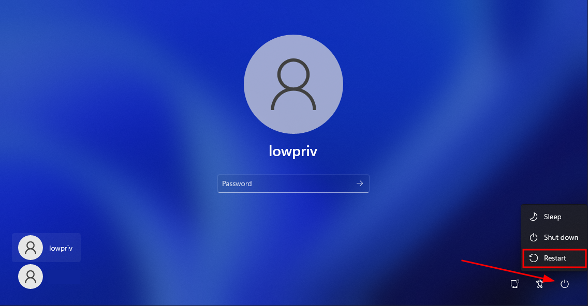

- once the windows logo appears and under it there (please wait) word release the shift key

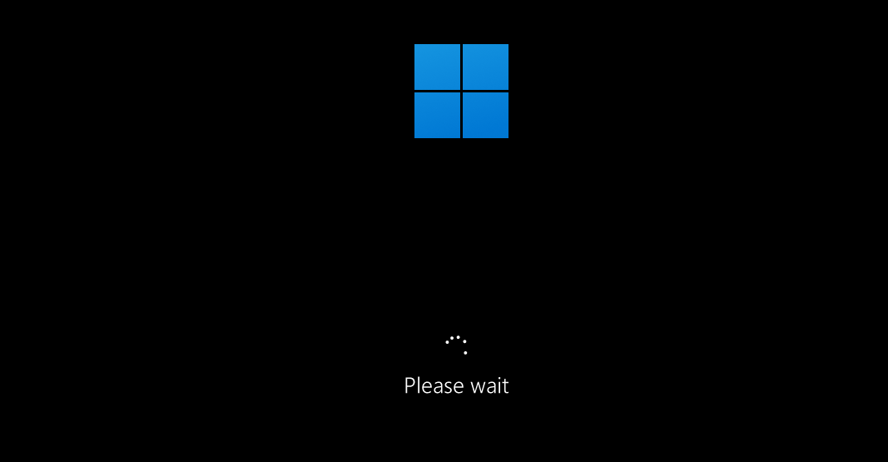


- windows is now in the advanced recovery mode, you should see this screen

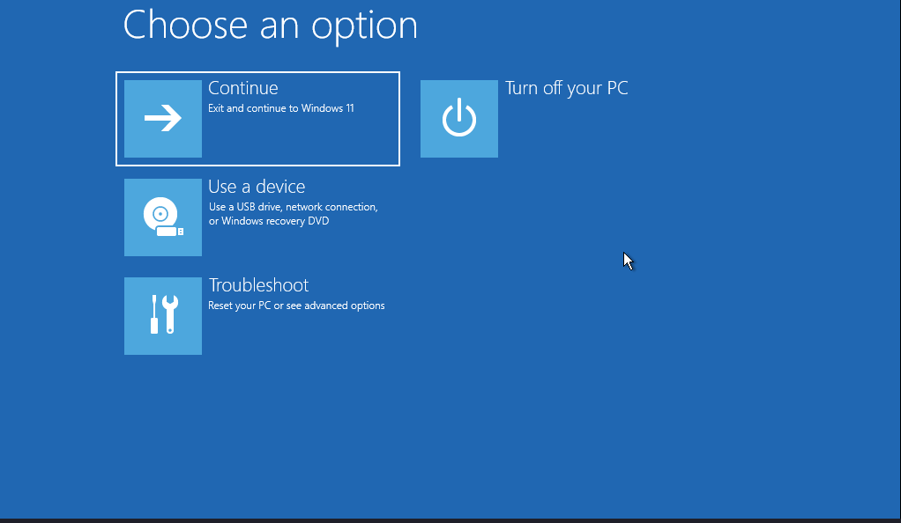

- once this screen appears click on (Troubleshoot)

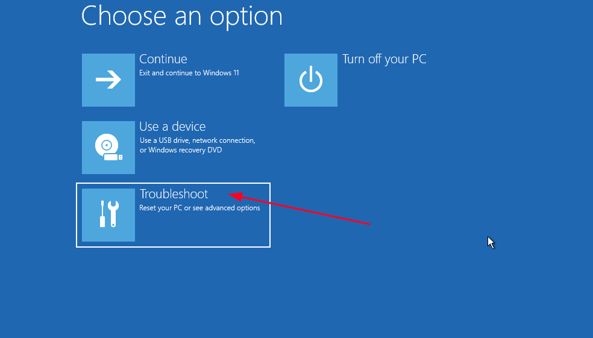

- then click on (advanced options) 

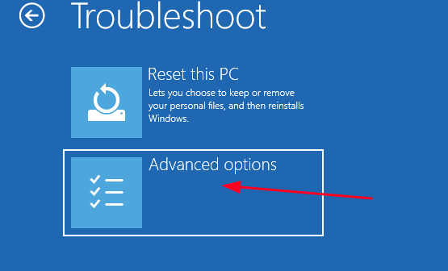

- in the advanced options screen there is a (command prompt) option click on it 

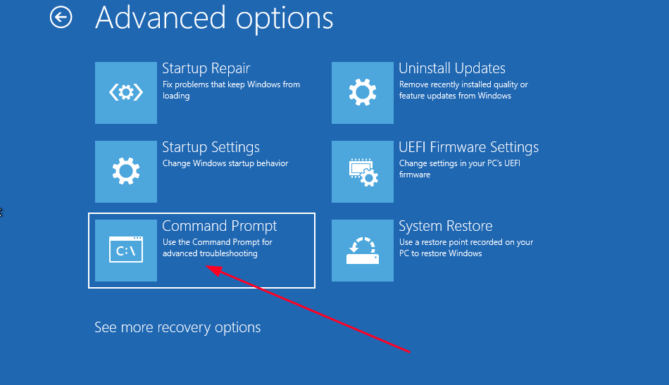

you should see a cmd prompt opened and notice 2 things in the very top:

	- its running as administrator
	- its running in the (x:) drive, but we need the (c:) drive

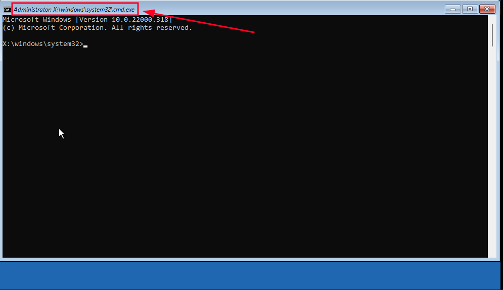


*a little brief about WinRE (windows recovery enviroment)*

- windows recovery operates like a seperate OS, in WinRE you have access to the other os's (the main windows) file system but you can't add or delete users or groups in the main OS from the WinRE


- to access the main file system drive from cmd type (c:) and press enter, this will tell the command prompt to change drives from 
(x:) -> the WinRE drive to (c:) -> the main windows drive

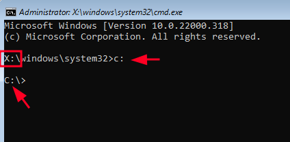

- once in the c:\ drive navigate to (c:\windows\system32) - `c:\> cd c:\windows\system32`

now there is a binary in the (system32) directory that run with elevated privs when you press (SHIFT) 5 times in the windows login screen, this binary is (sethc.exe)

if we copied the cmd.exe binary to the name of sethc.exe this will make windows execute the cmd.exe with administrator privs once we press (SHIFT) 5 times in the login screen, giving us full control on the machine without even a password *keep in mind that this time cmd.exe is running from the main os not the WinRE one therefore you can make any edit you want to the system*

- in system32 dir copy cmd.exe to sethc.exe and press yes when asks to overwrite (recommend to make a copy from the sethc.exe)

```
C:\windows\system32> copy cmd.exe sethc.exe
Overwrite sethc.exe> (Yes/No/All): YES
```

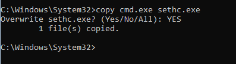

- once overwritten the sethc.exe with the cmd.exe binary close the command prompt and press on (continue to windows 11) and wait for windows to open

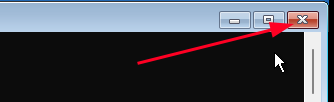

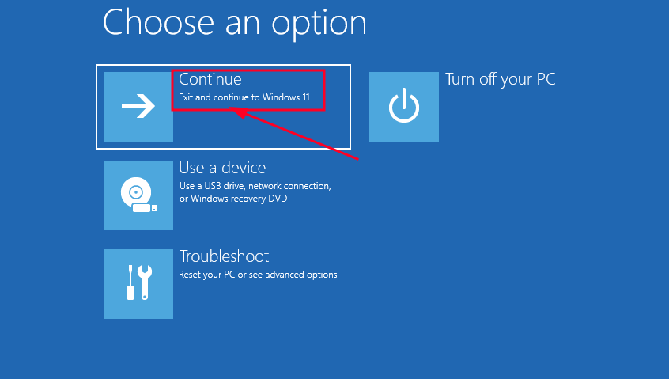

- once in the windows login screen press SHIFT 5 times and you should see an elevated command prompt opened like this

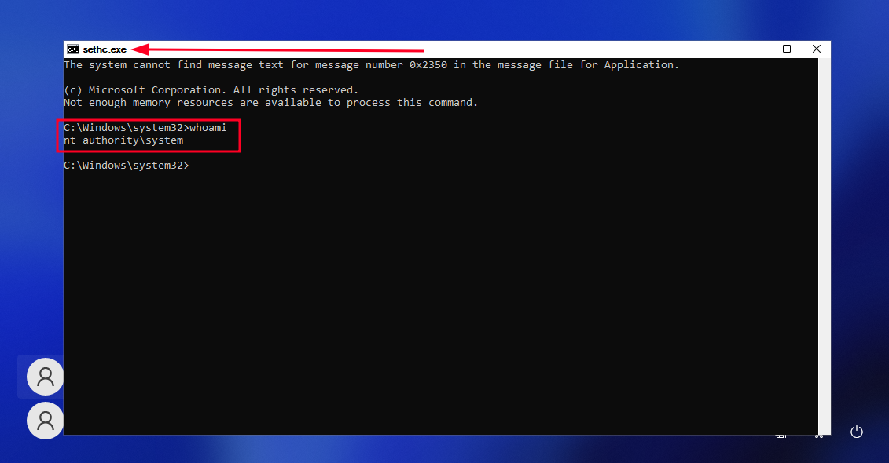 


Thats it !, you got admin shell without password, you can now do anything with it like adding your lowpriv user to the administrators group:`net localgroup administrators <USERNAME> /add` 


# part 2 - Linux

- machine used: ubuntu
---------------------------------

- once you boot up a linux machine press the (SHIFT) key, a grub menu well be displayed

*some Linux distros boot to grub automatically like (Kali-Linux)*

the Grub menu:

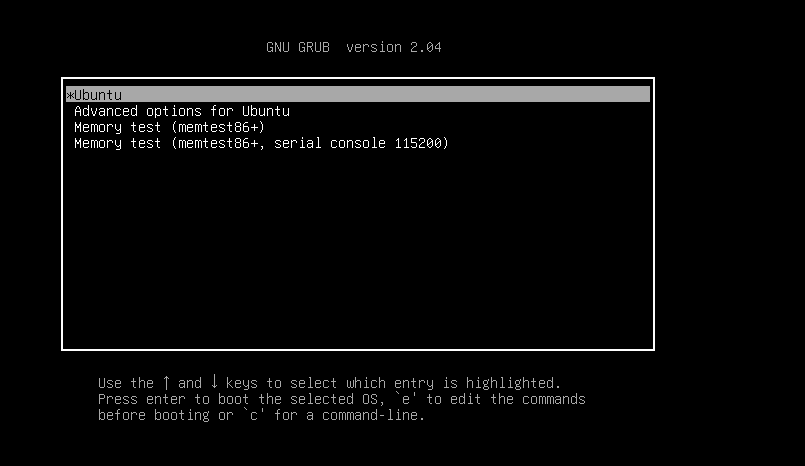 

- once in the grub menu press (e) on the keyboard to edit the boot commands, you should see an editor like this:

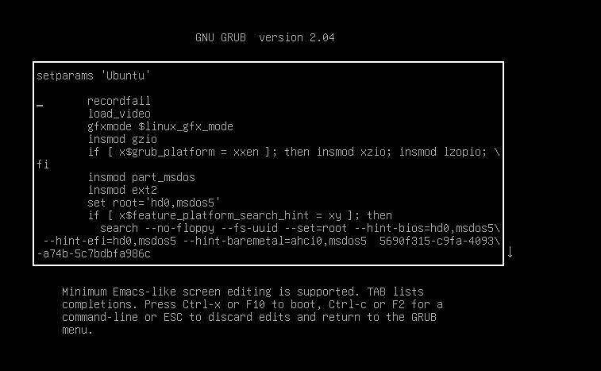 

 
- scroll down with the arrows until you see the line that starts with (linux)

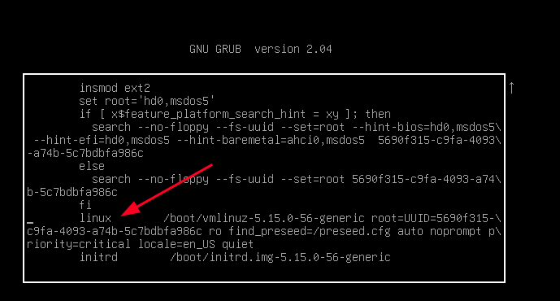


this line contains the used linux kernel and the argument for the kernel to boot with and we gonna edit those arguments

- first: change the (ro) -> read-only to (rw) -> read-write to have read-write to the machine when booting

- second: at the end of the line add this argument `init=/bin/bash` which will tell the kernel to immediatly drop in a bash shell once booted and this shell is a root shell ;)  


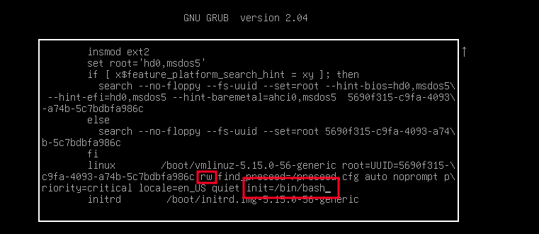 


- once edited press (CTRL+X) to boot with the edited configs and you should drop in a root shell like this:

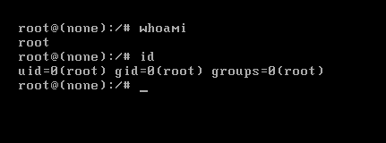 


at this point you have root access to the machine and you can change the root password or any other thing for example i added my user to /etc/sudoers to run sudo without password once i reboot the machine and login normally im gonna have full access 

in the last line of the /etc/sudoers file
`user ALL=(ALL) NOPASSWD:ALL`


another idea is to set the root account to use empty password `~# passwd -d root` (this may or may not work)